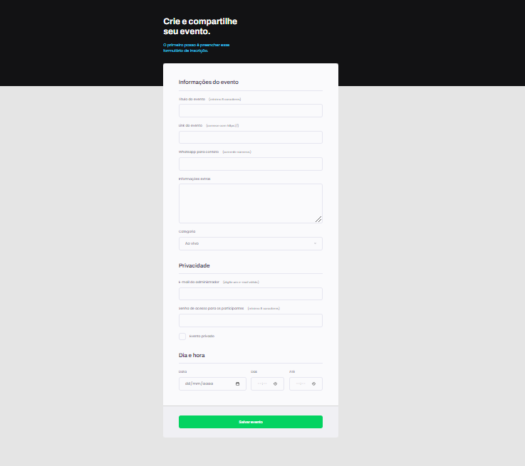

# Projeto Formulário 01

> Trilha Explorer

Primeiro projeto construído no módulo de formulários, deu pra se aprofundar muito nesse módulo, achei lindo demais os formulários da Rocketseat. Aprendi várias coisas, sobre o get e o post no form, como usar um input do tipo submit que não está dentro do form, atribuindo um ID no form e um form no input do tipo submit ou até mesmo no button.

[🔗 Clique aqui para acessar](https://filipesantos07.github.io/NLW-projeto-da-rocketseat/)

## 🛠️ Tecnologias

- HTML
- CSS

## 💛 Contato

FilipeSantosEstudos1@gmail.com